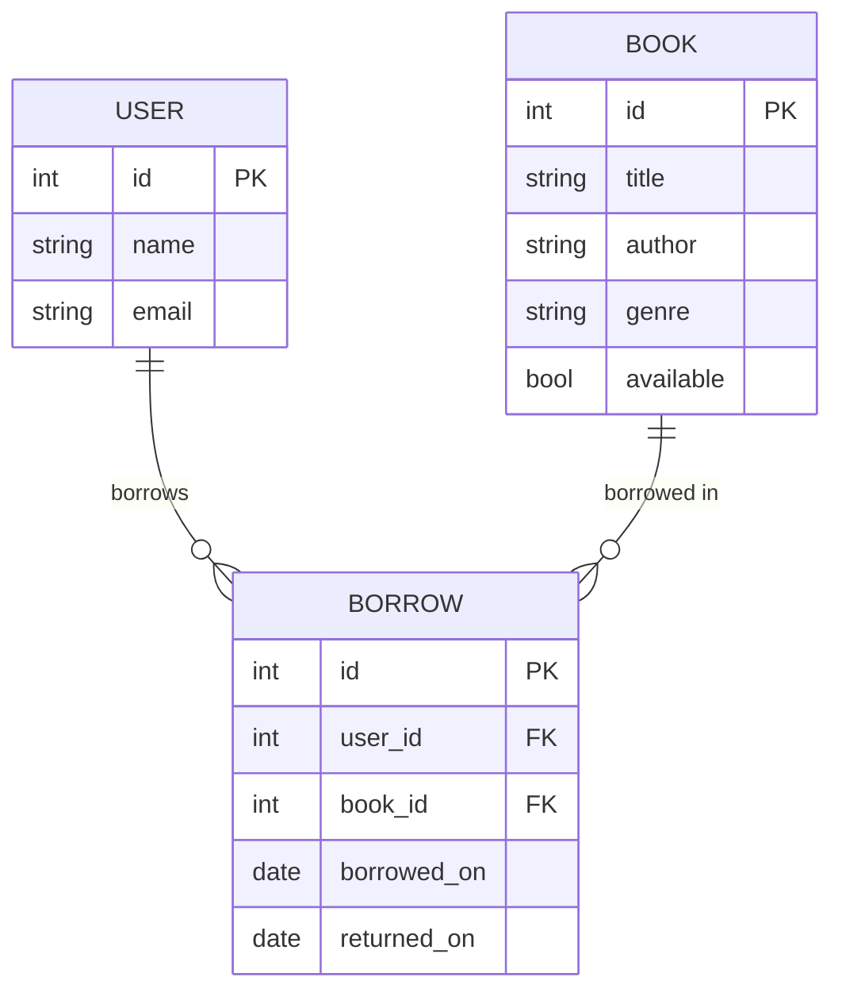
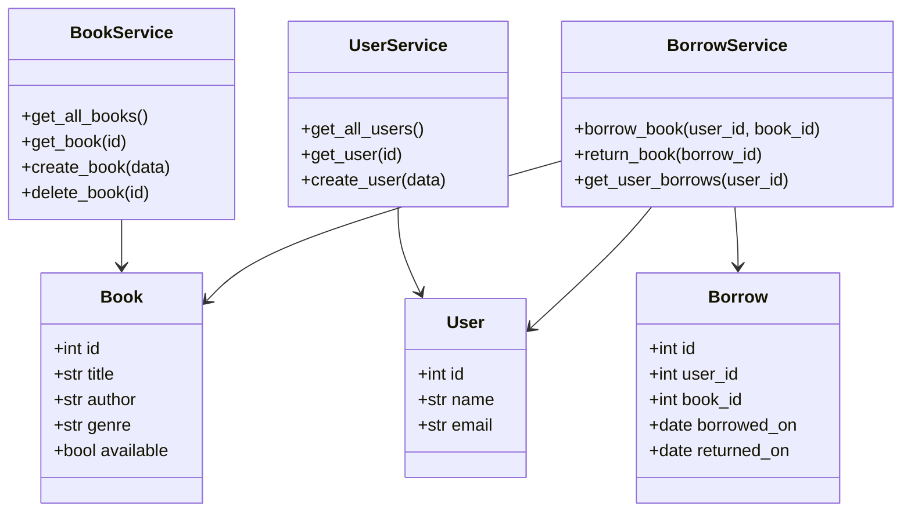

# Mini Librarian

A learning project built with FastAPI. You will build it in two levels.

---

## Level 1 — Build the API

You create a REST API that manages books and users. No AI yet, just clean code.

---

## File Structure

```
mini-librarian/
├── main.py               # starts the app, registers routes
├── models/
│   └── models.py         # database table definitions
├── services/
│   ├── book_service.py   # all database operations for books
│   └── user_service.py   # all database operations for users
├── routes/
│   ├── books.py          # HTTP routes for books
│   └── users.py          # HTTP routes for users
├── database.py           # database connection setup
└── requirements.txt
```

**Rule to remember:** models only describe data, services do database work, routes handle HTTP.

---

## Database Design (ERD)



---

## Class Diagram



---

## Routes to Build

### Books
| Method | Path | What it does |
|--------|------|--------------|
| GET | `/books` | list all books |
| GET | `/books/{id}` | get one book |
| POST | `/books` | add a book |
| DELETE | `/books/{id}` | remove a book |

### Users
| Method | Path | What it does |
|--------|------|--------------|
| GET | `/users` | list all users |
| GET | `/users/{id}` | get one user |
| POST | `/users` | register a user |

### Borrowing
| Method | Path | What it does |
|--------|------|--------------|
| POST | `/borrow` | borrow a book |
| PUT | `/borrow/{id}/return` | return a book |
| GET | `/users/{id}/borrows` | see what a user borrowed |

---

## Steps — Level 1

1. Create a virtual environment and install `fastapi`, `uvicorn`, `sqlmodel`
2. Write `database.py` — connect to SQLite
3. Write `models/models.py` — define `User`, `Book`, `Borrow` tables
4. Write `services/book_service.py` — functions that query the database
5. Write `services/user_service.py` — same for users
6. Write `services/borrow_service.py` — borrow and return logic
7. Write `routes/books.py` — call service functions from HTTP handlers
8. Write `routes/users.py` — same pattern
9. Write `main.py` — create the FastAPI app and include the routers
10. Run with `uvicorn main:app --reload` and test with the auto docs at `/docs`

Complete each step before moving to the next one.

---

## Level 2 — Add a Chat Assistant (coming next)

Once Level 1 works, you will add a chat endpoint that answers book questions.

The assistant will:
- read the database to find books
- use an AI model to answer questions like "suggest a mystery for a beginner"
- return a plain-text answer

You will add one new route `/chat` and one new service `chat_service.py`. Nothing else changes.

That is the plan. Go build Level 1 first.
